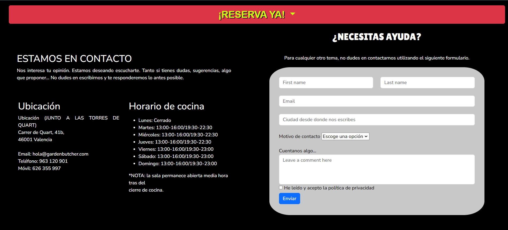

 # Garden Butcher

Garden Butcher es una WEB para un restaurante que tiene principios de respeto animal por lo que toda la comida que se comercializa es vegana. Encontramos platos principales con una gran variedad de hamburguesas que se pueden acompañar de los entrantes y bebidas del menú.

## Contenido

- [Introducción](#introducción)
- [Características](#características)
- [Tecnologías](#tecnologías-utilizadas) 
- [Agradecimiento](#agradecimientos)
- [Algunos Errores](#algunos-errores)
- [Captura de Pantalla](#capturas-de-pantalla)
 
 

## Introducción

Este ha sido mi primer proyecto durante mi formación como desarrollador Full Stack en GeeksHubs Academy, que con solo una semana de formación me ha permitido realizar una Web para un restaurante utilizando tecnologías nuevas para mi.

La inspiración de la temática parte por los principios que tiene mi esposa y la dieta que ella lleva y a la cual estoy muy familiarizado. 

## Características

En esta WEB podremos ver que consta de tres pestañas. La primera, es el home, donde nos da la bienvenida con un carrusel de fotos que incluyen mensajes utilizando call to actions con la idea de impactar al visitante. Mientras vamos bajando nos encontramos un apartado donde habla un poco sobre la historia y misión del restaurante, hasta llegar al apartado que nos habla sobre los beneficios de la alimentación vegana.

En la segunda pestaña, nos entramos la gran variedad de hamburguesas que tiene el menú, con entrantes y bebidas en la misma carta.

y parta terminar, la tercera pestaña aporta información de contacto para el cliente, además, incluye un formulario donde el cliente podrá dirigirse al departamento correspondiente para para trasladar su información.

## Tecnologías Utilizadas

 
 

## Agradecimientos

Agradecimientos especiales a mi profesor David Ochando por su entrega y dedicación a la hora de formarnos en esta nueva aventura que es la programación.

## Algunos Errores

Algunos errores que no he podido solucionar es esta primera edición de este proyecto son: 

- Los márgenes derechos de la página los cuales con la clase container-fluid no he podido solucionar.
- Algunas de las imágenes del menú tampoco se han podido ajustar a la caja contenedora.

## Capturas de Pantalla

 

